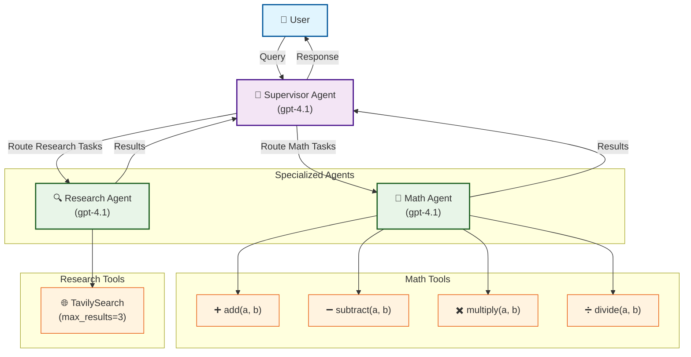

# LangGraph Supervisor

A multi-agent AI system built with LangGraph that intelligently routes user queries between specialized agents for optimal task handling.

## 🎯 Overview

This project implements a **supervisor pattern** using LangGraph to manage two specialized AI agents:

- **🧮 Math Agent**: Handles mathematical calculations, arithmetic, and numerical problems
- **🔍 Research Agent**: Manages factual queries, web searches, and information retrieval

The supervisor intelligently routes user queries to the appropriate agent based on the content and context of the request.

## 🏗️ Architecture Diagram



## ✨ Features

- **Intelligent Routing**: Automatic task delegation to specialized agents
- **Rich UI**: Beautiful terminal interface with colors and progress indicators
- **Comprehensive Evaluation**: LLM-as-a-Judge evaluation system using Braintrust
- **Real-time Processing**: Streaming responses with live updates
- **Error Handling**: Robust error management and fallback mechanisms

## 🛠️ Technology Stack

- **[LangGraph](https://langchain-ai.github.io/langgraph/)**: Multi-agent workflow orchestration
- **[LangChain](https://langchain.com/)**: LLM framework and integrations
- **[Braintrust](https://braintrust.dev/)**: AI evaluation and observability
- **[Rich](https://rich.readthedocs.io/)**: Terminal UI enhancements
- **[Tavily](https://tavily.com/)**: Web search API for research tasks

## 📋 Prerequisites

- Python 3.9+
- OpenAI API key
- Tavily API key  
- Braintrust API key

## 🚀 Quick Start

### 1. Clone the Repository

```bash
git clone <repository-url>
cd langgraph-supervisor
```

### 2. Install Dependencies

Using uv (recommended):
```bash
uv pip install -r requirements.txt
```

CI note: our scheduled workflow uses uv in GitHub Actions for Python setup and dependency install. See `.github/workflows/run_on_schedule.yml` and uv's GitHub guide [Using uv in GitHub Actions](https://docs.astral.sh/uv/guides/integration/github/#setting-up-python).

### 3. Environment Setup

Create a `.env` file in the project root:

```env
OPENAI_API_KEY=your_openai_api_key_here
TAVILY_API_KEY=your_tavily_api_key_here
BRAINTRUST_API_KEY=your_braintrust_api_key_here
ENDPOINT_AUTH_TOKEN=your_long_random_token
```

### 4. Run the Application (choose one)

- Local CLI runner:

```bash
python -m src.local_runner
```

- Modal web endpoint (development):

```bash
modal serve src/app.py
```

Then call it with (Authorization header required; send the question in `q`):

```bash
curl -X POST \
  -H "Authorization: Bearer $ENDPOINT_AUTH_TOKEN" \
  -H 'Content-Type: application/json' \
  --data '{"q": "What is 2 + 2?"}' \
  $(modal url)
```

- Modal deploy (persistent):

```bash
modal deploy src/app.py
```

## 💬 Usage Examples

### Math Queries
```
You: What is 15 + 27?
🤖: 42

You: Calculate the square root of 169
🤖: 13
```

### Research Queries
```
You: Who is the mayor of Denver?
🤖: The current mayor of Denver is Mike Johnston.

You: What is the capital of Japan?
🤖: The capital of Japan is Tokyo.
```

### Interactive Commands
- Type your question and press Enter
- Use `quit`, `exit`, or `q` to exit the application
- Ctrl+C for emergency exit

## 📊 Evaluation System

This project includes a comprehensive evaluation framework using **LLM-as-a-Judge** methodology.

### Running Evaluations Locally

```bash
# Run the evaluation suite locally
braintrust eval evals/

# Or run with dev server (for playground testing)
braintrust eval evals/eval_simple.py --dev
```

### Remote Eval Server on Modal

Deploy the evaluation server to Modal for remote testing from the Braintrust Playground:

```bash
# Deploy to Modal
modal deploy src/eval_server.py

# Or test in dev mode first
modal serve src/eval_server.py
```

Then connect to it from the Braintrust Playground using your Modal URL. See [`docs/MODAL_EVAL_SERVER.md`](docs/MODAL_EVAL_SERVER.md) for detailed instructions.

### Evaluation Metrics

- **🎯 Routing Accuracy**: Measures correct agent selection
- **📝 Response Quality**: Assesses answer accuracy and completeness
- **⚡ Step Efficiency**: Tracks number of steps to completion
- **🔗 Source Attribution**: Verifies citations and sources

### Configurable Parameters

The evaluation system supports parameterized testing of:
- System prompts (supervisor, agents)
- Agent routing descriptions
- Model selections (gpt-4o-mini, gpt-4o, etc.)

All parameters have sensible defaults defined in `src/config.py`.

### View Results

Evaluation results are automatically uploaded to your Braintrust dashboard where you can:
- Track performance over time
- Compare different model versions and prompts
- Analyze detailed evaluation traces
- Run A/B tests with different configurations
- Export results for further analysis

## 📁 Project Structure

```
langgraph-supervisor/
├── src/                          # Main application code
│   ├── app.py                   # Modal web endpoint (exposes `app` and POST /)
│   ├── eval_server.py           # Modal remote eval server deployment
│   ├── local_runner.py          # Local CLI runner for interactive use
│   ├── agent_graph.py           # Agent/supervisor construction and tracing
│   ├── config.py                # Centralized configuration and defaults
│   ├── helpers.py               # Utility functions for UI
│   ├── agents/                  # Agent implementations
│   │   ├── deep_agent.py        # Supervisor with subagent routing
│   │   ├── math_agent.py        # Math calculation agent
│   │   ├── research_agent.py    # Web research agent
│   │   ├── state.py             # Agent state definitions
│   │   └── tracing.py           # Braintrust tracing utilities
│   └── __init__.py
├── evals/                       # Evaluation framework
│   └── eval_simple.py          # LLM-as-a-Judge evaluations with parameters
├── docs/                        # Documentation
│   └── MODAL_EVAL_SERVER.md    # Guide for Modal eval server deployment
├── requirements.txt             # Python dependencies
├── pyproject.toml              # Project metadata and dependencies
├── .env.example                # Environment variables template
├── .gitignore
├── scripts/
│   └── run_queries.py           # Generates N LLM questions and hits the endpoint
└── README.md
```

## 🔧 Configuration

### Agent Customization

Modify agent behavior in `src/app.py`:

```python
# Customize math agent
math_agent = create_react_agent(
    model="openai:gpt-4.1",
    tools=[add, multiply, divide],
    prompt="Your custom math agent prompt...",
    name="math_agent",
)

# Customize research agent  
research_agent = create_react_agent(
    model="openai:gpt-4.1",
    tools=[web_search],
    prompt="Your custom research agent prompt...",
    name="research_agent",
)
```

### Supervisor Behavior

Adjust supervisor routing logic:

```python
supervisor = create_supervisor(
    model=init_chat_model("openai:gpt-4.1"),
    agents=[research_agent, math_agent],
    prompt="Your custom supervisor prompt...",
    add_handoff_back_messages=True,
    output_mode="full_history",
).compile()
```

## 🧪 Development

### Adding New Agents

1. Create agent in `src/app.py`:
```python
new_agent = create_react_agent(
    model="openai:gpt-4.1",
    tools=[your_tools],
    prompt="Agent prompt...",
    name="new_agent",
)
```

2. Add to supervisor agents list:
```python
agents=[research_agent, math_agent, new_agent]
```

3. Update supervisor prompt to include routing logic

### Adding Evaluation Tests

Extend the evaluation dataset in `evals/eval_simple.py`:

```python
{
    "input": {
        "messages": [
            {
                "content": "Your test question",
                "type": "human",
                # ... other fields
            }
        ]
    }
}
```

## 📈 Performance Monitoring

The system automatically tracks:

- **Token Usage**: Input/output tokens per conversation
- **Response Times**: End-to-end latency metrics  
- **Agent Selection**: Routing decision accuracy
- **Error Rates**: Failed requests and error types

View metrics in your Braintrust dashboard for continuous monitoring and optimization.

## 🤝 Contributing

1. Fork the repository
2. Create a feature branch (`git checkout -b feature/amazing-feature`)
3. Commit your changes (`git commit -m 'Add amazing feature'`)
4. Push to the branch (`git push origin feature/amazing-feature`)
5. Open a Pull Request

### Development Guidelines

- Add tests for new functionality in `evals/`
- Update documentation for API changes
- Follow existing code style and patterns
- Ensure all evaluations pass before submitting

## 📄 License

This project is licensed under the MIT License - see the [LICENSE](LICENSE) file for details.

## 🆘 Support

- **Issues**: Report bugs and request features via [GitHub Issues](../../issues)
- **Discussions**: Join conversations in [GitHub Discussions](../../discussions)
- **Documentation**: Full docs available at [Project Wiki](../../wiki)
